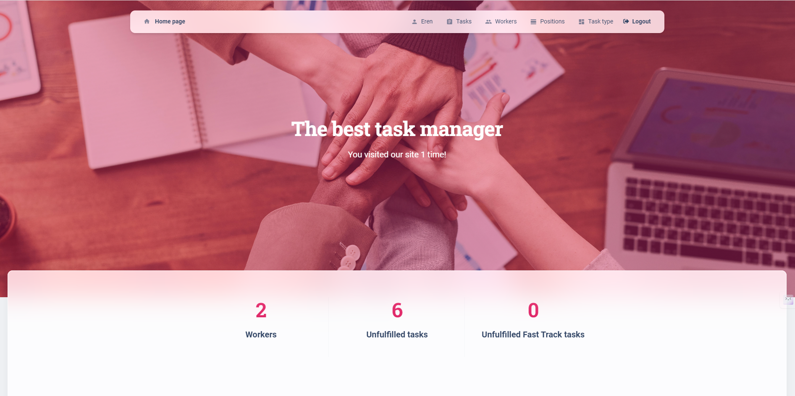

# Task Manager

## Overview
**Task Manager** is a convenient tool for managing team projects. The application allows each employee to create, delete, and update tasks, assign them to team members, and mark tasks as completed. Additionally, you can create, delete, and update positions and task types. On the corresponding pages, you can view information about task workers, types of tasks, and professions.

## Features
- Create, delete, and update tasks.
- Assign tasks to team members.
- Mark tasks as completed.
- Create, delete, and update positions.
- Create, delete, and update task types.
- View information about task workers, types of tasks, and professions.

## Additionally
Some **names** have links to detailed information about themselves and edit and delete buttons

## Deployment
The project is deployed and can be tested at the following link:
https://task-manager-6kb6.onrender.com

## Login Details
To test the project, use the following login details:

- **Username**: `user`
- **Password**: `user12345`
## Getting Started
These instructions will help you set up the Task Manager on your local machine for development and testing purposes.

### Prerequisites
List the prerequisites, such as software or packages that need to be installed:
- Node.js
- npm or yarn
- Python (if needed)
- Other dependencies specified in requirements.txt or package.json

### Installation
1. Clone the repository:
    ```bash
    git clone https://github.com/yourusername/task-manager.git
    ```
2. Navigate to the project directory:
    ```bash
    cd task-core
    ```
3. Install the dependencies:
    ```bash
    pip install -r requirements.txt
    ```

## How to Deploy Locally
To deploy the Task Manager locally, follow these steps:

1. **Set Up Environment Variables**:
    - Create a `.env` file in the root directory.
    - Add the necessary environment variables as specified in `.env.example` or the documentation.

2. **Start the Development Server**:
    - For a Python project, run:
        ```bash
        python app.py
        ```
    - For other frameworks, refer to the respective documentation.

3. **Access the Application**:
    - Open your browser and navigate to `http://localhost:3000` (or the specified port) to see the application running.

4. **Run Tests** (optional):
    - Execute the test suite to ensure everything is working correctly:
        ```bash
        pytest
        ```

# Database schema


# Home page


# Worker detail


# Task list


# Worker list


# Position list


# Task type list
